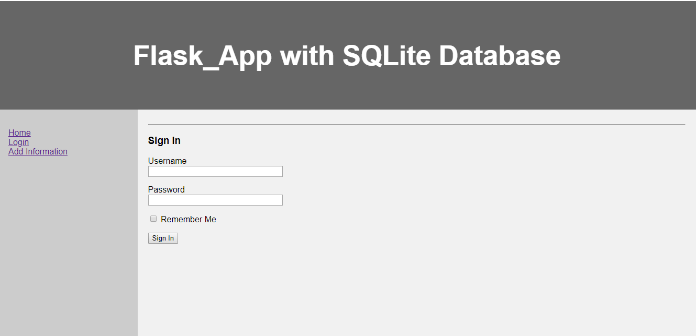
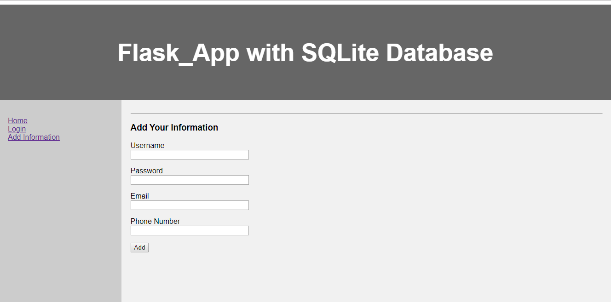

# Flask_App1
## A Basic web application to connect flask with database.

### Objective
The goal of this application is to use the Flask framework of python and make two forms (Add Information and Login)
Both forms are connected to info_db. If user's information is in database only then user can login.

### ScreenShots

